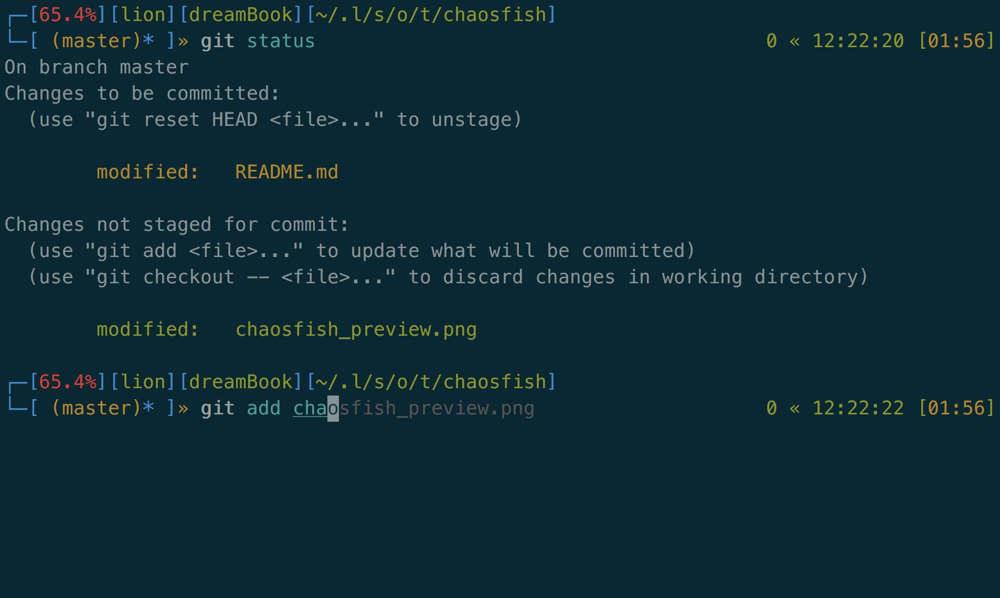

## Requirements

Battery plugin to display the status of the battery

`omf install battery`

## chaosFish

Based on omf theme [Zish](https://github.com/oh-my-fish/theme-zish) and bash_it theme [kitsune](https://github.com/Bash-it/bash-it/tree/master/themes/kitsune)

#### Left prompt

[Battery Percentage][User][host][abbreviated path]\n[git branch info]

#### Right prompt

exit code « Current Time [Battery Time left]

Enjoy!
